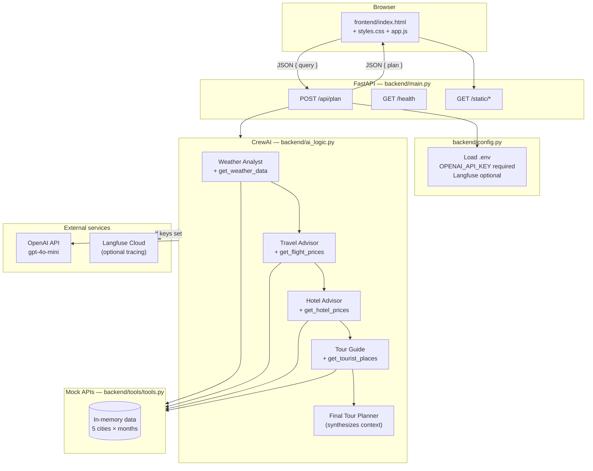

# Travel Planner

An AI-powered travel planning app that uses a **CrewAI** multi-agent crew to answer trip questions. You describe where and when you want to go; specialist agents gather weather, flights, hotels, and sights from mock APIs, then a planner agent synthesizes a single answer.

### Frontend

The UI in `frontend/` is **vibecoded with [Cursor](https://cursor.com)** — built iteratively in the editor with AI assistance rather than hand-scaffolded from a template. It is intentionally minimal: vanilla HTML, CSS, and JavaScript (no React/Vue build step), served by FastAPI as static files. The backend and CrewAI logic were written separately; the frontend only talks to `POST /api/plan`.

## Architecture



### Request flow

1. User submits a natural-language query in the web UI.
2. FastAPI validates the request and calls `travel_planner(query)`.
3. Four specialist agents run **sequentially**, each calling a CrewAI tool backed by hardcoded mock data.
4. The **Final Tour Planner** agent reads outputs from the prior tasks and writes the combined trip plan.
5. The plan text is returned to the browser and displayed on the page.

## Project structure

```
travel-app/
├── .env                 # Secrets (not committed)
├── .env.example         # Template for required env vars
├── requirements.txt
├── README.md
├── frontend/            # Vibecoded in Cursor (vanilla HTML/CSS/JS)
│   ├── index.html       # Minimal UI
│   ├── styles.css
│   └── app.js           # Calls POST /api/plan
└── backend/
    ├── main.py          # FastAPI app + static files
    ├── config.py        # Environment loading
    ├── ai_logic.py      # CrewAI agents, tasks, crew
    └── tools/
        └── tools.py     # Mock weather / flight / hotel / places APIs
```

## Prerequisites

- **Python 3.10+**
- An **OpenAI API key** (used via CrewAI’s `openai/gpt-4o-mini` LLM)
- Optional: **Langfuse** keys for observability/tracing

## Setup

### 1. Clone and enter the project

```bash
cd travel-app
```

### 2. Create a virtual environment

```bash
python3 -m venv venv
source venv/bin/activate   # Windows: venv\Scripts\activate
```

### 3. Install dependencies

```bash
pip install -r requirements.txt
```

### 4. Configure environment variables

Copy the example file and add your keys:

```bash
cp .env.example .env
```

Edit `.env`:

| Variable | Required | Description |
|----------|----------|-------------|
| `OPENAI_API_KEY` | Yes | OpenAI API key for the LLM |
| `LANGFUSE_SECRET_KEY` | No | Langfuse secret key |
| `LANGFUSE_PUBLIC_KEY` | No | Langfuse public key |
| `LANGFUSE_BASE_URL` | No | Defaults to `https://cloud.langfuse.com` |

Langfuse tracing is enabled only when **both** `LANGFUSE_SECRET_KEY` and `LANGFUSE_PUBLIC_KEY` are set.

## How to run

From the **project root** (so `.env` and `frontend/` resolve correctly):

```bash
source venv/bin/activate
PYTHONPATH=. uvicorn backend.main:app --reload --host 127.0.0.1 --port 8000
```

Open in your browser:

**http://127.0.0.1:8000**

### Health check

```bash
curl http://127.0.0.1:8000/health
# {"status":"ok"}
```

### API example

```bash
curl -X POST http://127.0.0.1:8000/api/plan \
  -H "Content-Type: application/json" \
  -d '{"query": "Plan a trip to Tokyo in July. What should I pack?"}'
```

Response:

```json
{
  "plan": "..."
}
```

## API endpoints

| Method | Path | Description |
|--------|------|-------------|
| `GET` | `/` | Serves the web UI |
| `GET` | `/health` | Server health check |
| `POST` | `/api/plan` | Generate a travel plan (`{ "query": "..." }`) |
| `GET` | `/static/*` | CSS and JavaScript assets |

## Supported mock data

Tools use **hardcoded** data (no real booking or weather APIs). Use these **exact city names** for best results:

| City | Months with weather / flights / hotels |
|------|----------------------------------------|
| Tokyo | May–December (varies by tool) |
| Paris | May–December |
| Dubai | May–December |
| New York | May–December |
| Sydney | May–December |

**Example queries:**

- `Plan a trip to Paris in May. Budget and mid-range hotels?`
- `Dubai in August — weather, flights, and top places.`
- `New York in December. What clothes should I pack?`

Hotel data in the mock DB covers fewer months than weather/flights for some cities; agents are instructed not to invent numbers when tools return errors.

## Agents

| Agent | Tool | Role |
|-------|------|------|
| Weather Analyst | `get_weather_data` | Temperature and conditions by city + month |
| Travel Advisor | `get_flight_prices` | Round-trip USD estimates |
| Hotel Advisor | `get_hotel_prices` | Budget / mid-range / luxury nightly rates |
| Tour Guide | `get_tourist_places` | Top sights in the city |
| Final Tour Planner | — | Combines prior outputs; packing tips, direct answer |

Tasks run with `Process.sequential` so each specialist completes before the final planner runs.

## Performance notes

- A full plan triggers **multiple LLM calls** (one crew run with several agents). Expect **1–3 minutes** per request depending on API latency.
- The UI shows a loading state while `/api/plan` is in progress.
- CrewAI may write local storage under your user data directory on first import.

## Troubleshooting

| Issue | Fix |
|-------|-----|
| `Missing required environment variable: OPENAI_API_KEY` | Create `.env` from `.env.example` and set the key |
| `ModuleNotFoundError: backend` | Run from project root with `PYTHONPATH=.` |
| `ModuleNotFoundError: fastapi` | `pip install -r requirements.txt` inside `venv` |
| Empty or generic plan | Use a supported city name and month (e.g. `Paris`, `May`) |
| Slow responses | Normal for multi-agent runs; check OpenAI quota and network |

## License

Add your license here if this project is shared publicly.
